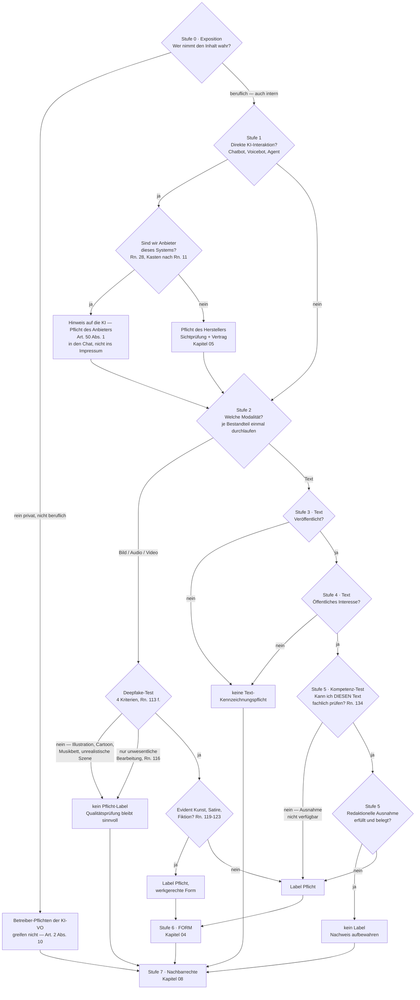

# Entscheidungsbaum: Wann muss ich kennzeichnen?

> 🤖 **Mit KI erstellt — ohne redaktionelle Gegenlese.** Dieser Text wurde von
> KI-Agenten erzeugt und maschinell gegen die amtlichen Quellen geprüft. Er hat
> **keine redaktionelle Gegenlese durch einen Menschen mit einschlägiger
> Fachkompetenz** durchlaufen; die Ausnahme des Art. 50 Abs. 4 UAbs. 2 KI-VO wird
> daher **nicht in Anspruch genommen**. Was genau geprüft wurde und was nicht:
> [Herkunft und Prüfung](../../PROVENANCE.de.md).

> ⚠️ **Kein Rechtsrat.** Dieses Playbook ist eine technische und redaktionelle Arbeitshilfe.
> Die Leitlinien der EU-Kommission (C(2026) 5054 final) sind rechtlich unverbindlich; verbindlich
> auslegen kann die KI-Verordnung nur der EuGH. Mit C(2026) 5054 final hat die Kommission den
> Inhalt des Leitlinien-Entwurfs gebilligt; förmlich angenommen werden die Leitlinien erst, wenn
> alle Sprachfassungen vorliegen. Zu Art. 50 gibt es noch keine Rechtsprechung — dieses Playbook
> baut eine begründbare Position, keinen Safe Harbour.
> **Stand: 24.08.2026; aktualisiert am 01.10.2026.**

## Gebrauchsanleitung

Der Baum sortiert den Normalfall **in unter einer Minute** vor: Stufe 0 bis 5 entscheiden
„Label ja/nein", Stufe 6 klärt die **Form**, Stufe 7 die Pflichten und Verbote **neben** Art. 50.
Zu jedem Knoten steht unten ein Abschnitt mit Prüffragen, Fundstelle und Verweis aufs
Detail-Kapitel.

Drei Regeln für die Benutzung:

1. **Grauzonen lösen keine Diskussion aus, sondern eine dokumentierte Begründung.** Wo ⚠️ steht,
   wird die Einstufung in zwei, drei Sätzen begründet und als Review-Record abgelegt (siehe
   [gate/](../../gate/README.de.md)). Fertig eingeordnete Einzelfälle: [Fallkatalog](02-fallkatalog.md).
   Typische Irrtümer: [Mythen-FAQ](06-mythen-faq.md).
2. **Erst Rolle, dann Inhalt.** Die Pflichten treffen unterschiedliche Akteure: Abs. 1 und Abs. 2
   den **Anbieter**, Abs. 3 und Abs. 4 den **Betreiber** (Leitlinien Rn. 6). Sie können
   nebeneinander gelten — *"The various transparency obligations laid down in Article 50 AI Act
   may apply cumulatively to (the output of) a single AI system, engaging possibly the
   responsibility of different actors"* (Rn. 8).
3. „**Rn.**" bezeichnet Randnummern der Kommissions-Leitlinien zur Transparenz KI-generierter
   Inhalte, C(2026) 5054 final vom 20.07.2026 (unverbindlich, s. o.); Normtexte und amtliche
   Quellen gesammelt in [Rechtsgrundlagen](08-rechtsgrundlagen.md).

> 🔑 **Der wichtigste Merksatz zuerst:** Die redaktionelle Ausnahme gilt **nur für Text** — für
> Bilder, Audio und Video gibt es keine. Dort zählt allein der Deepfake-Test; die Kunst-Ausnahme
> lockert nur die **Form** der Offenlegung (Art. 50 Abs. 4 KI-VO; Rn. 119–123, 133). Ein Deepfake
> bleibt kennzeichnungspflichtig, egal wie gründlich ein Mensch ihn geprüft hat.
>
> 🧭 **Eselsbrücke:** Text fragt „Wer hat's geprüft?" — Bild fragt „Wirkt's echt?"

## Der Baum

**Ein Durchlauf je Bestandteil.** Enthält eine Veröffentlichung mehrere Modalitäten (Text plus
KI-Beitragsbild, Video mit generierten Untertiteln), wird der Baum **je Bestandteil einmal**
durchlaufen. Sonst fällt der häufigste Realfall durchs Raster: Der gegengelesene Text kann über
Stufe 5 label-frei bleiben, während das beigestellte KI-Bild ein Deepfake ist — die redaktionelle
Ausnahme trägt nur Text (Rn. 133). Genau so trennt es der Beispiel-Record in
[`gate/templates/review-record.example.json`](../../gate/templates/review-record.example.json).

Ausgeklammert: die Ausnahme für gesetzlich erlaubte Strafverfolgung (Art. 50 Abs. 4 KI-VO;
Rn. 125 für Deepfakes, Rn. 139 für Text) — für Marketing-, Agentur- und Redaktionsarbeit ohne
Relevanz.

## Stufe 0 — Exposition: Wer nimmt den Inhalt wahr?

**Prüffragen:** Handle ich rein privat — oder beruflich/geschäftlich (auch als Freelancer, auch
monetarisiertes Social Media)? Wer entscheidet über den KI-Einsatz? Bleibt der Inhalt intern oder
geht er an ein Publikum? Welches Publikum ist **vernünftigerweise vorhersehbar**?

**Rein persönlich und nicht beruflich ⇒ die Betreiber-Pflichten der KI-VO greifen nicht.**
Art. 2 Abs. 10 KI-VO nimmt natürliche Personen aus, die KI-Systeme im Rahmen einer *"purely
personal, non-professional activity"* nutzen. Die Grenze zieht Rn. 19 scharf: *"Any activity
through which natural persons gain an economic benefit on a regular basis or are otherwise
involved in a professional, business, trade, occupational or freelance activity should be
considered as a ‘professional’ activity."* Der monetarisierte Kanal ist damit drin, die private
Weihnachtskarte draußen. Beides muss zutreffen — persönlich **und** nicht beruflich (Rn. 19).
Wichtig: Die Ausnahme betrifft nur die **Betreiber**-Pflichten; das System selbst bleibt im
Anwendungsbereich, und die maschinenlesbare Markierung des Anbieters nach Art. 50 Abs. 2 bleibt
unberührt — *"The system as such remains within the scope of the AI Act as regards the
obligations of providers"* (Rn. 20). Dieselbe Randnummer stellt klar, dass die Ausnahme
*"without prejudice to the application of other relevant Union and national law"* gilt:
Urheber-, Persönlichkeits- und Datenschutzrecht bleiben auch beim privaten Deepfake anwendbar —
deshalb führt auch dieser Ast weiter zu **Stufe 7**.

**Wer ist überhaupt Betreiber?** Maßgeblich ist die Autorität über den Einsatz — *"assuming
responsibility over the decision to deploy the system and over the manner of the actual use of the
system (including its outputs)"*; technische Kontrolle ist nicht nötig (Rn. 12). Daraus folgt:

- Angestellte, Contractor und Freelancer sind **keine eigenen Betreiber**; die Firma bzw. Agentur,
  unter deren Autorität gearbeitet wird, bleibt es (Rn. 14).
- Wer eine Agentur nur beauftragt, *"without taking decisions and exercising control over whether
  and how the advertising agency uses AI in the production process"*, ist **nicht** Betreiber
  (Beispiel zu Rn. 14). Zuordnung und Vertragsklauseln:
  [Kapitel 05](05-agentur-und-vertraege.md).

**Intern ist nicht automatisch frei — nach Modalität unterscheiden:**

- **Text:** Die Text-Pflicht setzt *Veröffentlichung* voraus (→ Stufe 3); organisationsinterne
  Texte und interne Kommunikation sind nicht „published" (Rn. 131 i).
- **Bild/Audio/Video:** Der Deepfake-Tatbestand verlangt **keine** Veröffentlichung. Rn. 112 nennt
  nur vier Voraussetzungen: KI-System, berufliche Nutzung, Deepfake, keine
  Strafverfolgungs-Ausnahme. Der Beispielkatalog nennt ausdrücklich das *"AI-generated video
  featuring a realistic synthetic avatar of a company CEO congratulating employees with their work
  and the corporate results of the past year"* (Kasten nach Rn. 116) — der CEO-Avatar an die
  Belegschaft ist auch **intern** zu kennzeichnen; eine Zeile im Intro genügt praktisch (Form →
  [Kapitel 04](04-kennzeichnung-form.md)).

**Maßstab ist das vorhersehbare Publikum** (Rn. 115), und zwar in beide Richtungen:

- Kein Zwang zur Maximalannahme: *"if deep fake content is shown solely on a subscriber-only part
  of a website or as part of a corporate newsletter, this does not imply that the deployer should
  consider broad public accessibility by default"*. Weiterverbreitung durch Dritte jenseits des
  vorhersehbaren Publikums muss nicht eingerechnet werden.
- Aber: Gehören Kinder, ältere Menschen oder Gruppen mit geringerer KI-Kompetenz vorhersehbar zum
  Publikum, kann schon die Täuschungseignung **ihnen** gegenüber den Deepfake begründen (Rn. 115).
- Umgekehrt gilt: Bei einer öffentlichen Website sind Bildersuche und Repost vorhersehbar — das
  wirkt sich vor allem auf die Platzierung des Labels aus (Stufe 6).

## Stufe 1 — Direkte KI-Interaktion?

**Prüffragen:** Interagiert eine Person unmittelbar mit dem System (Chatbot, Voicebot, KI-Hotline,
Agent)? Wer ist Anbieter dieses Systems — wir oder ein Zulieferer? Ist der KI-Charakter aus Sicht
einer verständigen Person wirklich offensichtlich?

**Adressat ist der Anbieter, nicht der Betreiber.** Art. 50 Abs. 1 KI-VO verpflichtet Anbieter,
interaktive Systeme so zu gestalten, dass die Betroffenen über die KI informiert werden — außer die
KI-Natur der Interaktion ist *"obvious from the point of view of a natural person who is reasonably
well-informed, observant and circumspect"* (Rn. 29; Maßstab und Kontextbezug in Rn. 42–44). Die
Leitlinien sind bei der Rollenfrage eindeutig: *"Article 50(1) AI Act is addressed to providers"*
(Rn. 28; ebenso Rn. 29, 32). Praktisch heißt das:

- **Eigener Bot, selbst entwickelt oder unter eigenem Namen in Betrieb genommen ⇒ du bist
  Anbieter** (Art. 3 Nr. 3 KI-VO; Kasten nach Rn. 11: *"a company or another organisation … that
  has developed an interactive AI system (e.g. chatbot) in-house and puts it into service in the
  Union for its own use and under its name or trademark"*). Wer ein fremdes System verändert —
  im Beispiel der Leitlinien *"with new training data"* — und danach unter eigenem Namen in
  Betrieb nimmt, wird Anbieter des neuen Systems (derselbe Kasten nach Rn. 11). Rollen können
  zusammenfallen: In-House-System plus eigene Nutzung = Anbieter **und** Betreiber (Rn. 15).
- **Zugekaufter Bot, unverändert eingebunden ⇒ Anbieter ist der Hersteller.** Art. 50 Abs. 1
  trifft dich dann nicht unmittelbar — die Sichtprüfung, ob der Hinweis in der eigenen Einbettung
  wirklich erscheint, ist trotzdem Pflichtprogramm der Praxis und gehört in den Vertrag
  ([Kapitel 05](05-agentur-und-vertraege.md)).
- **Hinweis in den Chat, nicht ins Impressum:** Die Information muss spätestens bei der ersten
  Interaktion ankommen (Art. 50 Abs. 5 KI-VO; Rn. 33; Beispiel zu Rn. 143: *"when launching a
  conversation with a chatbot"*). In Handbuch, Menü-Ebenen oder AGB versteckt genügt nicht
  (Rn. 142). Formulierungsbausteine: [Kapitel 04](04-kennzeichnung-form.md).
- **„Offensichtlich" ist kein Bauchgefühl:** Der Anbieter muss die Offensichtlichkeit *"assess and
  demonstrate"* (Rn. 42), gemessen an einem durchschnittlichen Mitglied des vorhersehbaren
  Publikums (Rn. 43–44).

**Abgrenzung nach unten** (Rn. 30 iii): Wenn Mitarbeitende KI nur als Hilfsmittel nutzen und die
Nachricht selbst verantworten und senden, liegt keine direkte Interaktion vor. Mischformen aus
KI-Antworten und menschlich kuratierten Inhalten fallen dagegen in den Anwendungsbereich und
verlangen Offenlegung für die KI-Anteile, *"unless those AI outputs have been properly reviewed and
sent by humans as the main interlocutors with the natural persons"*.

**KI-Agenten** müssen zweierlei offenlegen: die künstliche Natur **und** die Person, für die sie
handeln (Rn. 31) — auch gegenüber denen, die sie beauftragen, an den Schlüsselschritten
(Autorisierung, Freigabe, Bericht).

⚠️ Diese Stufe erledigt nichts weiter: Für die **Inhalte**, die dabei entstehen oder ausgespielt
werden, geht es bei Stufe 2 weiter — Art. 50 Abs. 1 und Abs. 4 können nebeneinander gelten (Rn. 8).

## Stufe 2 — Bild, Audio, Video: der Deepfake-Test

**Prüffrage:** Würde der Inhalt einer Person **fälschlich als echt oder wahrheitsgemäß
erscheinen**? Art. 3 Nr. 60 KI-VO wird in vier kumulative Kriterien zerlegt (Rn. 113):

| # | Kriterium | Kern | Anker |
|---|---|---|---|
| 1 | **Ähnlichkeit** | Die Ähnlichkeit mit dem simulierten Subjekt muss *"appreciable"* sein — hoher Grad an Übereinstimmung, Identität nicht nötig; objektiver Einzelfallvergleich | Rn. 113 i; ErwGr. 134 |
| 2 | **Existenz** | existiert, kann plausibel existieren oder könnte plausibel existiert haben — also auch **frei erfundene, fotorealistische Menschen und Avatare**; ausgenommen sind Darstellungen, die Natur- oder Biologiegesetze brechen (fliegende Menschen, Drachen, Auto fahrende Elefanten) | Rn. 113 ii |
| 3 | **Subjekt** | Personen (inkl. digitaler Repliken realer Personen, realistischer KI-Avatare und -Personas, Stimme, Verhalten, Performance), Objekte (inkl. Gebäude, Konsumgüter), Orte, Entitäten (Tiere und andere Lebensformen), Ereignisse (inkl. Darstellung von Dienstleistungen) | Rn. 113 iii |
| 4 | **Wirkt fälschlich echt** | Gesamtbetrachtung aus Ähnlichkeit, Aussage, Einsatzkontext, Umfeld und vorhersehbarem Publikum; **objektiver Maßstab, keine Täuschungsabsicht nötig**; Fotorealismus macht es wahrscheinlicher, aber *"photorealism alone is not determinative for the assessment"* | Rn. 113 iv; Rn. 114 |

Fehlt eines der vier Kriterien, ist es **kein Deepfake** — Illustration, Cartoon, erkennbar surreale
Szene, Instrumental-Musikbett ohne Wirklichkeitsabbild. Label-frei heißt aber nicht prüf-frei:
Faktencheck und Rechte-Klärung bleiben sinnvoll (→ Stufe 7 und [gate/](../../gate/README.de.md)).
Kontextbeispiel aus Rn. 114: KI-Hintergründe, Spezialeffekte und technisches Pre-/Postprocessing in
der normalen Filmproduktion lassen den Inhalt regelmäßig nicht fälschlich echt wirken — voll
KI-generierte Schauspieler, digitale Repliken, De-Aging und simulierte Darbietungen dagegen schon.

**Bagatell-Weiche (Rn. 116):** Unwesentliche Eingriffe machen aus Bestandsmaterial keinen Deepfake —
*"editing background details (e.g. removing passerby)"*, Licht, Audio-Parameter, Farbkorrektur,
Entrauschen, Barrierefreiheits-Verbesserungen, Kompression, kosmetische Anpassungen. In
Produktwerbung und auf Verpackungen zählen ausdrücklich auch *"background extensions of existing
content, adjustments or replacements of backgrounds for clearly aesthetic purposes, compositions and
arrangements of existing products, or re-scaling of images"* dazu. **Die Weiche kippt**, sobald

- die Manipulation das **Produkt oder Subjekt selbst** betrifft — Beispielkatalog: ein KI-Bild eines
  Produkts in Werbung oder Verpackung, das die Wahrnehmung des Publikums beeinflusst und täuscht
  *"as to the actual product appearance, characteristics or use (e.g. making the product appear not
  identical to the real product, more appealing or with improved quality than in real life)"*
  (Kasten nach Rn. 116), oder
- **journalistische Bilder** über die Standard-Redaktionspraxis hinaus verändert werden
  (*"substantial AI-powered editing of background details of journalistic images beyond standard
  technical, editorial practices"*, Rn. 116 a. E.).

⚠️ Objektentfernung und Hintergrundtausch sind damit kontextabhängig (Immobilienfoto: Mülleimer weg
≠ Feuchtefleck weg): Grauzone — Einstufung mit kurzer Begründung dokumentieren (siehe
[gate/](../../gate/README.de.md)). Eingeordnete Einzelfälle: [Fallkatalog](02-fallkatalog.md).

**Kunst-Weiche (Rn. 119–123):** Bei **evident** künstlerischen, kreativen, satirischen oder
fiktionalen Werken bleibt die Pflicht bestehen — gelockert wird nur die Form: Offenlegung *"in an
appropriate manner that does not hamper the display or enjoyment of the work"* (Rn. 119, 123), etwa
im Abspann oder Impressum statt als Dauer-Overlay. Zwei Bremsen: *"Evidently"* ist **eng**
auszulegen, mehrdeutige Inhalte fallen heraus (Rn. 122); und bei Mischcharakter *"the informative
character should always prevail"* — dann gilt das Standard-Label (Rn. 122). Werbung qualifiziert nur
*"in certain, specific situations"*; der Negativkatalog nennt Teleshopping-Deepfakes und den
*"realistic synthetic influencer testing out a sponsored real product"* (Kasten nach Rn. 124). Form
im Detail: [Kapitel 04](04-kennzeichnung-form.md).

Hier greift der Merksatz aus der Einleitung: **Gegenlesen befreit Bilder nicht.** Die redaktionelle
Ausnahme steht ausschließlich in Art. 50 Abs. 4 UAbs. 2 und betrifft nur Text (Rn. 133).

## Stufe 3 — Text: veröffentlicht?

**Prüffrage:** Ist der Text einem **unbestimmten, größeren Personenkreis** zugänglich — auch gegen
Bezahlung oder Abo?

*"Published"* heißt: *"accessible by an indeterminate, fairly large number of unrelated, potential
readers simultaneously and/or successively, whether or not against payment"* (Rn. 131 i). **Nicht**
veröffentlicht sind laut derselben Randnummer private und berufliche Einzelkorrespondenz,
geschlossene private Kleingruppen sowie organisationsinterne Texte und Kommunikation (Intranet).
Auch die Chatbot-Antwort, die nur der fragende Nutzer sieht, ist nicht veröffentlicht (Kasten nach
Rn. 131) — auf der Website steht sie dann aber doch.

⚠️ Die Zwischenzone (offene Community, großer Verteiler, halböffentliche Gruppe) ist eine echte
Grauzone; Rn. 131 i nimmt Gruppen nur aus, wenn sie geschlossen und *"too small or insignificant"*
sind: Grauzone — Einstufung mit kurzer Begründung dokumentieren (siehe
[gate/](../../gate/README.de.md)).

**Zeitregel:** Es zählt das **Veröffentlichungs**datum, nicht das Erzeugungsdatum — *"if texts that
have been generated or manipulated before 2 August 2026 are published on or after that date, they
need to be labelled"* (Rn. 154).

Nein ⇒ keine Text-Kennzeichnungspflicht, weiter zu Stufe 7. Ja ⇒ Stufe 4.

## Stufe 4 — Thema von öffentlichem Interesse?

**Prüffrage:** Informiert der Text die Öffentlichkeit über Angelegenheiten von öffentlichem
Interesse? Rn. 131 iii zählt auf: Politik und demokratische Prozesse, Verwaltung und öffentliche
Dienstleistungen, Justiz und Strafverfolgung, Grundrechte, öffentliche Sicherheit, **Gesundheit**,
Umweltschutz, **Verbrauchersicherheit** sowie *"any economic, financial, political, scientific, or
cultural development that may be relevant subject of public debate"*. Dazu muss der Text überhaupt
Wissen, Meinungen oder Fakten vermitteln — sehr kurze Texte ohne solchen Gehalt fallen heraus
(Rn. 131 ii).

- **In Scope** (Kasten nach Rn. 131): KI-Zusammenfassung eines Zeitungsartikels über einen
  Ratsbeschluss; *"AI-manipulated parts of a lifestyle-website article comparing the effects of
  various diets on a particular disease"*; KI-veränderte Unternehmensberichte mit
  Investoreninformationen; Unwetterwarnung eines Wetterdienstes im Social-Media-Kanal. Klassischer
  Ratgeber-Content liegt dieser Liste oft näher, als Marketing-Teams annehmen.
- **Out of Scope:** KI-generierte Romane; Chatbot-Antworten nur an den Fragenden; Beratungstexte an
  einen Mandanten; Werbe- und Produkttexte — letztere aber mit ausdrücklicher **Rückausnahme**:
  *"not including any claims related to e.g. health, consumer safety or sustainability"* (Kasten
  nach Rn. 131). Ein Produkttext mit Gesundheits-, Sicherheits- oder Nachhaltigkeitsaussage ist
  damit wieder drin.

⚠️ Die Grenze „Werbung ↔ Information von öffentlichem Interesse" ist die häufigste Grauzone dieser
Stufe: Grauzone — Einstufung mit kurzer Begründung dokumentieren (siehe
[gate/](../../gate/README.de.md)).

Nein ⇒ keine Text-Kennzeichnungspflicht, weiter zu Stufe 7. Ja ⇒ Stufe 5.

## Stufe 5 — Redaktionelle Ausnahme

**Prüffragen:** Kann ich **diesen** Text überhaupt fachlich prüfen? Hat ein Mensch mit
einschlägiger Sachkunde die **Substanz** geprüft (mindestens Faktencheck)? Trägt eine benannte
natürliche oder juristische Person die redaktionelle Verantwortung, öffentlich auffindbar? War die
Freigabe der **letzte inhaltsändernde Schritt**?

### Vorgeschaltet: der Kompetenz-Test

Bevor die beiden Bedingungen überhaupt zur Debatte stehen, steht eine Selbstprüfung — und ihre
Frage lautet **nicht** „bin ich Experte?", sondern **„kann ich DIESEN Text fachlich prüfen?"**.
Rn. 134 knüpft die Kompetenz ausdrücklich an den Gegenstand: verlangt sind Personen *"possessing
relevant knowledge and professional judgement pertaining to the subject matter under scrutiny"*.
Maßstab ist das Thema, nicht der Titel.

Vier Prüfsätze, alle vier ehrlich mit Ja zu beantworten:

1. Kann ich die zentralen **Sachaussagen** als richtig oder falsch erkennen?
2. Kann ich die **Quellen** beurteilen — ob sie tragen, aktuell und einschlägig sind?
3. **Würde ich Fehler bemerken** — auch die, die plausibel klingen?
4. Kann ich den Text **aus inhaltlichen Gründen** ändern oder ablehnen?

**Die Kompetenz ist themenbezogen**, deshalb fällt die Antwort bei derselben Person je nach Text
verschieden aus: Wer über das **eigene Produkt** schreibt, das er gebaut, betrieben und gemessen
hat, hat sie regelmäßig. Wer über ein **fremdes Fachgebiet** schreibt — Recht, Medizin, fremde
Technik —, regelmäßig nicht; dort liest sich ein falscher KI-Satz genauso flüssig wie ein
richtiger.

> ⚖️ **Konsequenz, wertfrei:** Fällt eine der vier Antworten „nein" aus, ist die Ausnahme für
> diesen Text **nicht verfügbar** — dann wird gekennzeichnet. Das ist kein Scheitern, sondern der
> zweite vom Gesetz vorgesehene Weg: Art. 50 Abs. 4 UAbs. 2 KI-VO ordnet die Offenlegung an
> (*"shall disclose"*) und stellt die Ausnahme daneben (*"This obligation shall not apply
> where …"*). Kennzeichnen ist der Regelweg, nicht der Ausfallweg.
> Ausgebaut ist dieser Weg in [Kapitel 09](09-kennzeichnungs-weg.md): Kennzeichnungszeile,
> Platzierung, Herkunftsseite, Stand-Datum.
>
> ⛔ **Warnsatz:** Ein dokumentierter Review-Nachweis von jemandem, der die Substanz nicht
> beurteilen kann, ist **schlechter als keiner** — aus einem Unterlassen wird eine dokumentierte
> Falschaussage. (Lesart dieses Playbooks, gefolgert aus Rn. 134 und der Negativliste Rn. 135,
> die *"cursory editorial approval without substantive engagement"* ausdrücklich ausschließt;
> die Leitlinien sagen dazu nichts eigens.)

Ausführlich — mit Selbsteinschätzungs-Checkliste und der Frage, wie der Test auf dem
editorial-control-Weg wirkt: [Kapitel 03](03-redaktions-ausnahme.md), Abschnitt 3.

### Und dann erst die beiden Bedingungen

Zwei **kumulative** Bedingungen (Rn. 133):

1. **Human Review oder Editorial Control** — *"deliberate examination of the substance of the
   content by one or more natural persons possessing relevant knowledge and professional
   judgement"*; *"Fact-checking the accuracy of the content is a minimum requirement"* (Rn. 134).
   **Nicht ausreichend** (Rn. 135): Rechtschreib- und Grammatikprüfung, die bloße Existenz einer
   Redaktionsrichtlinie, automatisierte Review-Prozesse (auch „KI prüft KI") und kursorisches
   Abnicken ohne substanzielle Befassung.
2. **Redaktionelle Verantwortung** einer benannten Person oder Stelle mit *"ultimate legal
   responsibility"*; Identität und Kontaktdaten *"should be made publicly available on an easily
   findable location"* (Rn. 138). Ein deutsches Impressum liefert Name und Kontakt in aller Regel
   schon; erkennbar sein muss zusätzlich, **wer** die redaktionelle Verantwortung trägt
   ([Kapitel 03](03-redaktions-ausnahme.md) zeigt Formulierung und deutsche Fundstellen —
   § 5 DDG, § 18 Abs. 2 MStV).
   Medienanbieter dürfen sich auf ihre bestehenden redaktionellen Prozesse und Standards stützen
   (Rn. 140); alle anderen können den Nachweis über einen als adäquat bewerteten Verhaltenskodex
   führen (Rn. 137).

> ⏱️ **Reihenfolge-Regel (Rn. 136):** *"Any substantive AI intervention occurring after the human
> review or editorial control process has taken place will therefore cause the exception to become
> void."* — Jeder substanzielle KI-Eingriff **nach** der redaktionellen Freigabe macht die Ausnahme
> nichtig. Die Gegenlese muss der letzte inhaltsändernde Schritt vor der Veröffentlichung sein.

Genau das operationalisiert das [Editorial-Gate](../../gate/README.de.md): ein Review-Record mit
SHA-256-Bindung an den freigegebenen Stand — jede spätere Änderung, auch durch KI, invalidiert den
Record und lässt CI rot werden. **Ehrliche Grenze:** Das Gate erzwingt den **Prozess** und macht ihn
nachweisbar; die inhaltliche Qualität der Prüfung erzwingt es nicht. Es ist eine über das rechtliche
Minimum hinausgehende, zulässige Dokumentationsform (Code of Practice on Transparency of
AI-Generated Content, Sec. 2, Commitment 4 — dort ist die Dokumentation einzelner Review-Vorgänge
ausdrücklich **nicht** verlangt, aber als Zusatzaufzeichnung vorgesehen), kein Safe Harbour.
Kriterien, Rollen und Belege im Detail: [Kapitel 03](03-redaktions-ausnahme.md).

Kompetenz-Test „nein" ⇒ Ausnahme nicht verfügbar, Label Pflicht, weiter zu Stufe 6.
Ausnahme erfüllt ⇒ kein Label, Nachweis aufbewahren, weiter zu Stufe 7.
Nicht erfüllt ⇒ Label Pflicht, weiter zu Stufe 6.

## Stufe 6 — FORM der Kennzeichnung

**Prüffragen:** Ist das Label ohne technische Hilfsmittel und ohne Klick oder Hover wahrnehmbar —
sichtbar bei Bild, Video und Text, **hörbar** bei Audio? Kommt es spätestens bei der ersten
Exposition an (Art. 50 Abs. 5 KI-VO; Rn. 141–143)? Überlebt es Zuschnitt, Repost und
Plattformwechsel?

> 📎 **Merksatz:** Die maschinenlesbare Anbieter-Markierung nach Art. 50 Abs. 2 ersetzt **nie** die
> eigene wahrnehmbare Kennzeichnung — *"deployers cannot rely on the machine-readable marking
> embedded in the content by the provider under Article 50(2) AI Act, since those markings are not
> immediately clear and distinguishable"* (Rn. 117).

Kurzfassung — alles Weitere in [Kapitel 04](04-kennzeichnung-form.md), zu Wasserzeichen und
Anbieter-Markierungen in [Kapitel 07](07-anbieter-markierungen.md): Es gibt keinen Pflicht-Wortlaut,
die EU-Icons sind optional; das Label muss klar und unterscheidbar sein und darf nicht in AGB,
Metadaten oder Menü-Ebenen verschwinden (Rn. 142). Label-Werkzeuge sehr großer Plattformen (etwa
KI-Toggles) können die Offenlegung **innerhalb** der Plattform tragen, wenn das erzeugte Label die
Anforderungen erfüllt — *"without prejudice to the responsibility of the deployers"*, und für die
Zweitverwertung außerhalb der Plattform tragen sie nicht (Rn. 126).

## Stufe 7 — Nachbarrechte-Check

**Prüffrage:** Was gilt zusätzlich — unabhängig davon, ob ein Label nötig war?

> 🚧 **Merksatz:** Ein Label ist kein Freifahrtschein — UWG-Irreführung, Urheber- und
> Persönlichkeitsrechte bleiben, und was verboten ist, bleibt verboten.

- **Verbotene Praktiken (Art. 5 KI-VO):** Ab dem 02.12.2026 verbietet Art. 5 Abs. 1 UAbs. 1
  lit. ba und bb KI-VO (eingefügt durch VO (EU) 2026/1744) KI-Systeme, die realistische intime
  Darstellungen einer bestimmbaren Person ohne deren ausdrückliche Zustimmung oder Darstellungen
  von sexuellem Missbrauch von Kindern erzeugen oder manipulieren; Betreiber trifft das Verbot,
  wenn sie ein System zu diesem Zweck verwenden (Art. 5 Abs. 1a lit. b). Ein Label macht eine
  verbotene Praxis nicht zulässig (Erwägungsgrund 137 KI-VO; Leitlinien Rn. 25) — Details:
  [Kapitel 08](08-rechtsgrundlagen.md), Abschnitt 6.
- **Lauterkeitsrecht:** Das Deepfake-Kriterium ist ausdrücklich unabhängig vom Irreführungsbegriff
  der Richtlinie 2005/29/EG zu verstehen (Leitlinien Fn. 32) — ein gekennzeichnetes, aber
  irreführendes Produktbild bleibt irreführend.
- **Urheber-, Datenschutz- und Persönlichkeitsrechte** bleiben unberührt (Rn. 124, 127–129); das
  gilt ausdrücklich auch für veröffentlichte Texte von öffentlichem Interesse (Fn. 34).
- **DSA:** Art. 35 Abs. 1 DSA verpflichtet sehr große Plattformen und Suchmaschinen zur
  Risikominderung; lit. k nennt prominente Markierungen erzeugter oder manipulierter Inhalte als
  **mögliche** Maßnahme — werkzeugneutral, also auch für Fälschungen ganz ohne KI (Rn. 126).
- **Plattform-Policies** (Upload-Disclosure, Werbekennzeichnung) sind eigene Vertragspflichten neben
  dem Gesetz.

Fundstellen und deutsche Zuständigkeiten: [Kapitel 08](08-rechtsgrundlagen.md); Verantwortlichkeit
in Auftragsketten: [Kapitel 05](05-agentur-und-vertraege.md).

---

**Ergebnis festhalten.** Der Baum endet nicht bei „Label ja/nein", sondern bei einer festgehaltenen
Einstufung: Ergebnis, Begründung in zwei bis drei Sätzen, Datum. Bei Text ist dieser Record zugleich
der Beleg für die redaktionelle Ausnahme ([gate/](../../gate/README.de.md)); bei Bild, Audio und Video ist
er die Grauzonen-Dokumentation, die im Streitfall zeigt, dass die Einstufung überlegt war.
