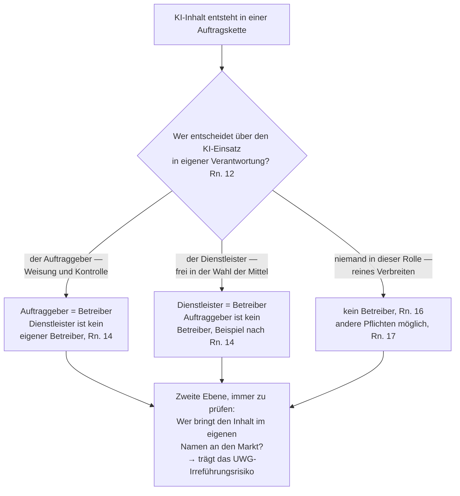

# Auftragsketten: Wer ist Betreiber, wer kennzeichnet, wer haftet

> 🤖 **Mit KI erstellt — ohne redaktionelle Gegenlese.** Dieser Text wurde von
> KI-Agenten erzeugt und maschinell gegen die amtlichen Quellen geprüft. Er hat
> **keine redaktionelle Gegenlese durch einen Menschen mit einschlägiger
> Fachkompetenz** durchlaufen; die Ausnahme des Art. 50 Abs. 4 UAbs. 2 KI-VO wird
> daher **nicht in Anspruch genommen**. Was genau geprüft wurde und was nicht:
> [Herkunft und Prüfung](../../PROVENANCE.de.md).

> ⚠️ **Kein Rechtsrat.** Dieses Playbook ist eine technische und redaktionelle Arbeitshilfe.
> Die Leitlinien der EU-Kommission (C(2026) 5054 final) sind rechtlich unverbindlich; verbindlich
> auslegen kann die KI-Verordnung nur der EuGH. Zu Art. 50 gibt es noch keine Rechtsprechung —
> dieses Playbook baut eine begründbare Position, keinen Safe Harbour. **Stand: 24.08.2026.**

„Wir bauen Websites mit teilweise KI-generierten Bildern — müssen wir kennzeichnen oder der
Kunde?" Das ist die häufigste Praxisfrage zu Art. 50, und sie hat **zwei** Antworten, weil zwei
Regime nebeneinanderlaufen:

1. **KI-Verordnung:** Die Kennzeichnungspflicht trifft den **Betreiber** — und Betreiber ist,
   wer über den KI-Einsatz in eigener Verantwortung entscheidet. Das ist nicht automatisch der,
   der publiziert, und nicht der, der die Maus bewegt.
2. **Lauterkeitsrecht:** Das Irreführungsrisiko trägt, wer den Inhalt im eigenen Namen an den
   Markt bringt — **unabhängig** davon, wer die Datei erzeugt hat.

Beide Fragen müssen getrennt beantwortet werden. Die Zuordnung nach Nr. 1 erledigt Nr. 2 nicht.

**Ob** überhaupt eine Kennzeichnungspflicht besteht, klärt der
[Entscheidungsbaum](01-entscheidungsbaum.md) — dieses Kapitel klärt, **wen** sie trifft und wer
am Ende dafür geradesteht.

---

## 1. Der Autoritäts-Test: Wer ist Betreiber?

Betreiber („deployer") ist nach **Art. 3 Nr. 4 KI-VO**, wer ein KI-System **in eigener
Verantwortung** verwendet — außerhalb einer rein persönlichen, nicht beruflichen Tätigkeit.
Die Leitlinien geben dem Begriff in **Rn. 12** eine praktikable Kontur:

> *"Deployers are natural or legal persons, public authorities, agencies or other bodies using
> AI systems under their authority, unless the use is for a personal non-professional activity.
> The 'authority' over an AI system should be understood as assuming responsibility over the
> decision to deploy the system and over the manner of the actual use of the system (including
> its outputs). It does not necessarily require technical control over the operation of the AI
> system, so long as the deployer takes the decision for what purposes and how to use the AI
> system (including in decentralised workflows and group corporate structures)."*
> — Leitlinien Rn. 12 (mit Fn. 5: Art. 3 Nr. 4 KI-VO)

Daraus folgen drei Prüffragen — in dieser Reihenfolge:

1. **Wer hat entschieden, DASS KI eingesetzt wird?** (nicht: wer hat es bedient)
2. **Wer entscheidet über die ART der Nutzung** — welches System, wofür, und welcher Output
   geht heraus? Technische Kontrolle ist ausdrücklich **nicht** erforderlich (Rn. 12).
3. **Wer verantwortet den Output nach außen?**

Wer alle drei Fragen auf sich zieht, ist Betreiber. Wer keine davon beantwortet, ist es nicht.

**Was das für Personen im Team bedeutet:** Angestellte und weisungsgebundene Freelancer, die auf
Anweisung sowie unter Verantwortung und Kontrolle des Auftraggebers arbeiten, sind **keine eigenen
Betreiber** — die Pflicht bleibt bei der Person oder Firma, unter deren Autorität das System
genutzt wird:

> *"Where the deployer of an AI system is a legal person under whose authority the system is used
> (e.g. an advertising company), the individual employees that act under the instructions and
> under the control of that legal person (e.g. digital animators, web designers, content creators,
> journalists) should not be considered as separate deployers for that system. A legal person
> remains a deployer even if it involves third parties (e.g. contractors, freelancers) in the
> operation of the system on its behalf and under its responsibility and control."*
> — Leitlinien Rn. 14

Das ist eine Zuordnungs-, keine Entlastungsregel: Die Firma haftet für den KI-Einsatz ihrer Leute
und muss ihn deshalb **intern** steuern (Anweisung, Prozess, Kompetenz — vgl. Kodex Section 2,
Measure 2.2, der Schulungs- und Awareness-Maßnahmen ausdrücklich auch für externe Auftragnehmer
verlangt).

**Wer aus der Rolle fällt:** Wer nur verbreitet oder überträgt — Hosting-Dienste, Online-Plattformen,
Sender — ist **kein** Betreiber, solange er keine Autorität über den KI-Einsatz hat (Rn. 16). Und
wer ein System selbst baut oder wesentlich verändert und dann nutzt, ist **beides**: Anbieter und
Betreiber (Rn. 15) und schuldet dann zusätzlich die maschinenlesbare Markierung nach
Art. 50 Abs. 2 (→ [Kapitel 07](07-anbieter-markierungen.md)).

---

## 2. Fallgruppen

| # | Konstellation | Wer entscheidet über den KI-Einsatz? | Betreiber nach KI-VO | Fundstelle |
|---|---|---|---|---|
| 1 | Kunde beauftragt eine Werbung, **ohne** über KI zu entscheiden („macht mir ein Bild") | Agentur | **Agentur** — sie kennzeichnet; der Kunde ist nicht Betreiber | Beispielabsatz nach Rn. 14: *"a company that merely commissions an advertising agency to produce an advertisement, without taking decisions and exercising control over whether and how the advertising agency uses AI in the production process, is not a deployer"* |
| 2 | Agentur oder Freelancer bedient das System **auf Weisung und unter Kontrolle** des Kunden (Kunde gibt Tool, Prompt, Freigabe vor) | Kunde | **Kunde** — Dienstleister ist kein eigener Betreiber | Rn. 14 |
| 3 | Verlag/Sender erhält eine **fertige Anzeige mit unmarkiertem KI-Bild** und schaltet sie | der Anzeigenkunde bzw. dessen Agentur | **nicht** der Verlag, solange seine Rolle sich aufs Verbreiten beschränkt | Rn. 16 (Verbreiter sind keine Betreiber); Rn. 17 (andere Regelwerke können eigene Kennzeichnung verlangen — Beispiel: Sender labelt ein Deepfake im Programm) |
| 4 | **Content-Produzent liefert**, der Kunde publiziert | wer die KI-Entscheidung getroffen hat — Frage 1–3 aus Abschnitt 1 durchspielen | der Entscheider; das Label muss aber bis zur **ersten Exposition** beim Publikum durchhalten | Rn. 12 (Wertschöpfungsketten); Art. 50 Abs. 5 |
| 5 | Angestellte, Praktikanten, beauftragte Freelancer im laufenden Betrieb | die Firma, unter deren Aufsicht gearbeitet wird | **die Firma** — nie die einzelne Person | Rn. 14 |
| 6 | Firma baut/finetunt ein eigenes generatives System und nutzt es selbst | die Firma | **Anbieter *und* Betreiber** — Art. 50 Abs. 2 **und** Abs. 4 | Rn. 15 |

**Zu Fall 3 — die unangenehme Lücke:** Nach der KI-VO trifft den reinen Verbreiter keine
Kennzeichnungspflicht; die Leitlinien *ermutigen* ihn aber ausdrücklich, vorhandene Markierungen
und Labels zu erhalten (*"strongly encouraged to preserve the marking and labelling implemented
pursuant to Article 50 AI Act"*, Rn. 16) — und Rn. 17 stellt klar, dass andere Rechts- oder
Standesregeln eine eigene Kennzeichnung verlangen können. Ob und wie weit ein reines
Verbreitungsmedium daneben lauterkeitsrechtlich in Anspruch genommen werden kann, ist eine Frage
des UWG und hier nicht entschieden.
⚠️ Grauzone — Einstufung mit kurzer Begründung dokumentieren (siehe [gate/](../../gate/README.de.md)).

**Zu Fall 4 — geteilte Entscheidung:** Wenn Auftraggeber und Dienstleister *gemeinsam* über den
KI-Einsatz entscheiden (der Kunde will „irgendwas mit KI", die Agentur wählt Tool und Motiv), ist
die Zuordnung nicht eindeutig. Dann gilt: eine Partei benennen, die Begründung festhalten und
kennzeichnen. Zwei Labels schaden weniger als keines.
⚠️ Grauzone — Einstufung mit kurzer Begründung dokumentieren (siehe [gate/](../../gate/README.de.md)).

---

## 3. Die Praxis-Pointe: Der Veröffentlicher trägt das UWG-Risiko

Die wichtigste Erkenntnis dieses Kapitels steht nicht in der KI-VO:

> 🚧 **Wer den Inhalt im eigenen Namen an den Markt bringt — eigene Domain, eigener Shop, eigene
> Werbebotschaft —, trägt das Irreführungsrisiko nach §§ 5, 5a UWG, auch wenn nach der KI-VO ein
> anderer hätte kennzeichnen müssen.**

Warum das praktisch schwerer wiegt als das Bußgeld:

- **Es braucht keine Behörde.** Unterlassungsansprüche stehen Mitbewerbern, eingetragenen
  Wirtschafts- und Verbraucherverbänden sowie Kammern zu (**§ 8 Abs. 3 UWG**). Die Abmahnung kommt
  vom Wettbewerber, nicht von der Bundesnetzagentur — und sie kommt schneller.
- **Das Lauterkeitsrecht steht neben der KI-VO, nicht in ihr.** Das Deepfake-Kriterium ist
  ausdrücklich unabhängig vom Irreführungsbegriff der UGP-Richtlinie (Leitlinien Fn. 32), und die
  Transparenzpflicht erlaubt keine rechtswidrigen Inhalte: *"does not imply that AI-generated or
  manipulated deep fakes that are harmful and unlawful under the applicable Union or national law
  (e.g. misleading advertising or criminal law …) may be generated and disseminated"* (Rn. 129).
  Kurz: Ein Label ist kein Freifahrtschein — und das Fehlen eines Labels ist nicht das einzige
  Risiko. ⚠️ Ob Art. 50 zusätzlich eine Marktverhaltensregel i. S. v. § 3a UWG ist, ist
  höchstrichterlich offen (→ [Kapitel 08](08-rechtsgrundlagen.md), Abschnitt 4).
- **Der Rückgriff ist nachgelagert und vertragsabhängig.** Die KI-VO kennt keinen Regress. Wer
  abgemahnt wird, unterschreibt zuerst selbst die Unterlassungserklärung, zahlt zuerst selbst die
  Kosten und holt sie danach — in einem zweiten, eigenen Verfahren — beim Verursacher zurück,
  soweit der Vertrag das trägt und der Verursacher greifbar und solvent ist.

Daraus folgt die Arbeitsteilung dieses Kapitels: Die KI-VO sagt, **wer kennzeichnen muss**; der
Vertrag sagt, **wer es am Ende bezahlt**, wenn es keiner getan hat.

---

## 4. Was die Leitlinien selbst von Auftragsketten verlangen

Die Leitlinien adressieren Ketten ausdrücklich — und nennen den Vertrag als Mittel der Wahl:

> *"Deployers involved in complex content production and distribution value chains should take
> proportionate measures to ensure that the labelling of the content they have implemented
> pursuant to Article 50(4) AI Act is displayed in a clear and distinguishable manner for the
> targeted and foreseeable audience at the point of first exposure in accordance with
> Article 50(5) AI Act (e.g., via contractual conditions with distributing partners, user
> experience (UX) settings and interfaces to be displayed)."* — Leitlinien Rn. 12

Übersetzt: Es genügt nicht, ein Label **anzubringen**. Der Betreiber muss verhältnismäßige
Maßnahmen treffen, dass es beim Publikum auch **ankommt** — durch den Vertrag mit dem
Distributionspartner, durch die Wahl der Ausspielformate, durch die UX. Wer eine Datei mit
eingebranntem Label liefert, deren Ad-Zuschnitt es abschneidet, hat die Pflicht nicht erfüllt
(Crop-Check → [Kapitel 04](04-kennzeichnung-form.md), Abschnitt 4.1).

Für die **Text-Ausnahme** kommt eine zweite Vertragsfrage dazu: Wer trägt die redaktionelle
Verantwortung, und wer liest gegen? Der Kodex verlangt von Nicht-Medienunternehmen eine Policy mit
*"the identification of the natural or legal person with editorial responsibility (name, role and
contact details)"* (Section 2, Commitment 4); die Leitlinien wollen diese Angaben an leicht
auffindbarer Stelle öffentlich sehen (Rn. 138). In einer Agenturkette muss also feststehen, **wessen**
Name dort steht — Details: [Kapitel 03](03-redaktions-ausnahme.md).

---

## 5. Regelungspunkte-Checkliste für Verträge

> ⚖️ **Keine Musterklauseln.** Diese Liste sagt, **worüber** zu reden ist, nicht **wie** es zu
> formulieren ist. Ausformulierte Klauseln gehören in die Hand der eigenen Rechtsberatung — die
> Checkliste ist die Agenda für dieses Gespräch. Und: Ein Vertrag kann das Innenverhältnis regeln,
> aber die öffentlich-rechtliche Pflicht nicht verschieben. Adressat der Kennzeichnungspflicht
> bleibt, wer nach dem Autoritäts-Test (Abschnitt 1) Betreiber ist.

### 5.1 Offenlegung des KI-Einsatzes zwischen den Parteien

- [ ] Pflicht des Dienstleisters, den KI-Einsatz **ungefragt** offenzulegen — je Gewerk (Text,
      Bild, Audio, Video, Übersetzung, Untertitel) und je Modalität, nicht pauschal „KI wurde genutzt".
- [ ] Nachmeldung, wenn sich der Einsatz während des Projekts ändert (neues Tool, nachträgliche
      Bildbearbeitung, KI-Übersetzung der Endfassung).
- [ ] Klarstellung, dass auch **tool-interne** KI-Funktionen erfasst sind (generatives Füllen,
      Objektentfernung, Stimmsynthese) — die Grenze verläuft zwischen Funktionen, nicht zwischen
      Programmen (→ [Mythen-FAQ](06-mythen-faq.md), Mythos 6).
- [ ] Umgang mit Grauzonen: Wer entscheidet im Zweifel, und wird die Begründung mitgeliefert?

### 5.2 Zuordnung der Kennzeichnungspflicht entlang der Entscheidungsbefugnis

- [ ] Ausdrücklich festhalten, wer über den KI-Einsatz entscheidet — das entscheidet über die
      Betreiber-Rolle (Rn. 12, 14) und damit über die Pflicht.
- [ ] Wer bringt das Label an, in welcher Form, in welcher Sprache (→ [Kapitel 04](04-kennzeichnung-form.md))?
- [ ] Abnahme-Kriterium: Ein Gewerk gilt erst als geliefert, wenn das erforderliche Label
      vorhanden **und** im Zielformat sichtbar/hörbar ist.
- [ ] Klarstellung, dass die Zuordnung im Vertrag die gesetzliche Adressierung nicht ersetzt
      (siehe Kasten oben).

### 5.3 Label-Erhalt in der Verwertungskette

- [ ] Verbot, Labels und maschinenlesbare Markierungen zu entfernen oder zu überdecken — der
      Kodex verpflichtet Anbieter-Signatare, ein solches Verbot in ihre Nutzungsbedingungen
      aufzunehmen (Kodex-Measure 1.2 „Non-removal of markings" — die Anbieter-Verpflichtung);
      in der Kette muss es vertraglich weitergereicht werden.
- [ ] Zuschnitte, Thumbnails, Ad-Formate, Repost und Zweitverwertung: Wer prüft, dass das Label
      den Zuschnitt überlebt (→ [tools/label-crop-check](../../tools/label-crop-check/README.de.md))?
- [ ] Weitergabe an Distributionspartner: verhältnismäßige Maßnahmen, dass das Label bis zur
      ersten Exposition sichtbar bleibt (Rn. 12; Art. 50 Abs. 5).
- [ ] Übersetzungen, CMS-Import, Newsletter-Rendering: Wer stellt sicher, dass das Label mitwandert?

### 5.4 Review- und Freigabe-Zuständigkeit (nur für Text)

Für Bilder, Audio und Video gibt es **keine** redaktionelle Ausnahme — dort zählt allein der
Deepfake-Test ([Mythen-FAQ](06-mythen-faq.md), Mythos 8). Dieser Block betrifft daher nur Text.

- [ ] Wer liest gegen — mit welcher fachlichen Qualifikation zum Thema? Oberflächliche oder rein
      formale Prüfung genügt nicht (Rn. 134, 135).
- [ ] Wer trägt die redaktionelle Verantwortung, und mit welchen Kontaktdaten wird sie öffentlich
      gemacht (Rn. 138; Kodex Section 2, Commitment 4)?
- [ ] **Reihenfolge-Regel absichern:** Nach der redaktionellen Freigabe darf keine substanzielle
      KI-Änderung mehr erfolgen — *"Any substantive AI intervention occurring after the human review
      or editorial control process has taken place will therefore cause the exception to become void"*
      (Rn. 136). Wer in der Kette darf nach der Freigabe noch anfassen, und mit welchen Mitteln?
- [ ] Wer publiziert final — und läuft dazwischen noch ein automatisierter Schritt (SEO-Optimierer,
      KI-Kürzung für Social, automatische Zusammenfassung)?

### 5.5 Nachweis-Übergabe

- [ ] Der Dienstleister liefert den **Review-Record** mit: `<name>.review.json` neben der
      Inhaltsdatei, mit Reviewer, Fachkompetenz, redaktioneller Verantwortung, Prüfumfang,
      Einstufung und `content_sha256` der freigegebenen Fassung (Feldliste und Prüfskript:
      [gate/](../../gate/README.de.md)).
- [ ] Aufbewahrung: Wer hält die Nachweise wie lange vor — und wer legt sie bei einem
      Auskunftsersuchen der Marktüberwachung vor? Nicht-Signatare des Kodex müssen mit mehr
      Auskunftsersuchen rechnen, ausdrücklich auch zu ihrer Labelling-Praxis (Rn. 148).
- [ ] Ehrliche Grenze mitverhandeln: Das Gate erzwingt den **Prozess** und macht ihn nachweisbar;
      die inhaltliche Qualität der Prüfung erzwingt es nicht. Es ist eine über das rechtliche
      Minimum hinausgehende, zulässige Dokumentationsform (Kodex Section 2, Commitment 4), kein
      Safe Harbour.

### 5.6 Freistellung und Regress

- [ ] Wer trägt Abmahnkosten, Vertragsstrafen, Unterlassungserklärung, Rückruf- und
      Nachbesserungsaufwand, wenn ein Label fehlt oder falsch platziert war?
- [ ] Greift die Freistellung auch bei **Irreführung** (UWG) und bei Drittrechten (Urheber-,
      Marken-, Persönlichkeitsrechte, Datenschutz) — oder nur bei der Kennzeichnung? Die Leitlinien
      halten Drittrechte ausdrücklich für unberührt (Rn. 124, 127–129).
- [ ] Mitwirkungs- und Informationspflichten im Abmahnfall (Fristen sind kurz), Zuständigkeit für
      die Verteidigung, Deckung durch bestehende Versicherungen.
- [ ] ⚠️ Ausgestaltung, Reichweite und Wirksamkeit solcher Klauseln sind Rechtsberatung — diese
      Zeile ersetzt sie nicht.

---

## Kurz-Rekapitulation

1. Betreiber ist, wer über den KI-Einsatz **in eigener Verantwortung entscheidet** — technische
   Kontrolle ist nicht nötig (Rn. 12).
2. Wer unter Weisung und Kontrolle eines anderen arbeitet — Angestellte, Praktikanten,
   weisungsgebundene Freelancer —, ist **kein** eigener Betreiber; Betreiber bleibt die Person oder
   Firma, unter deren Autorität das System genutzt wird (Rn. 14). Entscheidet der Dienstleister
   dagegen selbst über den KI-Einsatz, ist er es selbst (Beispiel nach Rn. 14 — Punkt 3).
3. Wer nur beauftragt, ohne über den KI-Einsatz zu entscheiden, ist **nicht** Betreiber — dann
   kennzeichnet die Agentur (Beispiel nach Rn. 14).
4. Wer nur verbreitet, ist kein Betreiber (Rn. 16) — kann aber nach anderen Regeln kennzeichnen
   müssen (Rn. 17).
5. Unabhängig davon: **Der Veröffentlicher trägt das UWG-Irreführungsrisiko** (§§ 5, 5a, 8 Abs. 3 UWG).
   Regress ist möglich, aber nachgelagert und vertragsabhängig.
6. Das Label muss die Kette überleben — die Leitlinien nennen Vertragsbedingungen mit
   Distributionspartnern ausdrücklich als Mittel (Rn. 12).
7. Verträge regeln das Innenverhältnis, nicht die Adressierung der Pflicht.

Fundstellen und amtliche Dokumente: [Kapitel 08](08-rechtsgrundlagen.md) · typische Irrtümer:
[Mythen-FAQ](06-mythen-faq.md) · Nachweis-Mechanik: [gate/](../../gate/README.de.md).
