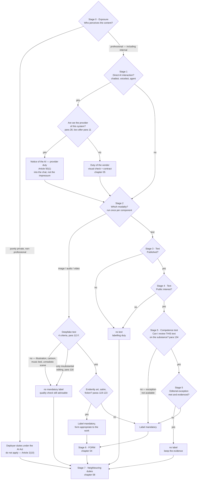

# Decision tree: when do I have to label?

> 🤖 **Made with AI — no editorial review.** This text was produced by AI agents
> and machine-verified against the official sources. It has **not undergone
> editorial review by a human with relevant subject-matter expertise**; the
> exception in Article 50(4), second subparagraph of the AI Act is therefore
> **not claimed**. What was verified and what was not:
> [Provenance](../../PROVENANCE.md).

> ⚠️ **Not legal advice.** This playbook is a technical and editorial working aid. The European
> Commission's guidelines (C(2026) 5054 final) are legally non-binding; only the Court of Justice of
> the European Union can interpret the AI Act with binding effect. There is no case law on
> Article 50 yet — this playbook builds a defensible position, not a safe harbour.
> **As of: 24 August 2026.**

## How to use it

The tree pre-sorts the normal case **in under a minute**: stages 0 to 5 decide
"label yes/no", stage 6 settles the **form**, stage 7 the duties **alongside** the AI Act.
Every node has a section below it with test questions, a source anchor and a pointer to the
detailed chapter.

Three rules for using it:

1. **Grey zones do not trigger a discussion, they trigger a documented rationale.** Wherever ⚠️
   appears, the classification is justified in two or three sentences and filed as a review record
   (see [gate/](../../gate/README.md)). Individual cases already classified:
   [case catalog](02-case-catalog.md). Typical misconceptions: [myths FAQ](06-myths-faq.md).
2. **Role first, then content.** The duties address different actors: Article 50(1) and (2) the
   **provider**, Article 50(3) and (4) the **deployer** (guidelines para 6). They can apply side by
   side — *"The various transparency obligations laid down in Article 50 AI Act
   may apply cumulatively to (the output of) a single AI system, engaging possibly the
   responsibility of different actors"* (para 8).
3. "**para**" refers to the paragraph numbers of the Commission's guidelines on transparency of
   AI-generated content, C(2026) 5054 final of 20 July 2026 (non-binding, see above); norm texts and
   official sources are collected in [legal basis](08-legal-basis.md).

> 🔑 **The most important rule of thumb first:** the editorial exception applies **to text only** —
> for images, audio and video there is none. There, only the deepfake test decides; the art
> exception merely relaxes the **form** of disclosure (Article 50(4) AI Act; paras 119–123, 133). A
> deepfake stays subject to the labelling duty no matter how thoroughly a human has reviewed it.
>
> 🧭 **Mnemonic:** text asks "who checked it?" — image asks "does it look real?"

## The tree

**One run per component.** Where a publication contains several modalities (text plus an AI featured
image, video with generated subtitles), the tree is run **once per component**. Otherwise the most
common real-world case slips through the net: the reviewed text can stay label-free via stage 5
while the accompanying AI image is a deepfake — the editorial exception carries text only
(para 133). That is exactly how the example record in
[`gate/templates/review-record.example.json`](../../gate/templates/review-record.example.json)
separates them.

Left out: the exception for law enforcement authorised by law (Article 50(4) AI Act;
para 125 for deepfakes, para 139 for text) — of no relevance to marketing, agency and editorial
work.

## Stage 0 — exposure: who perceives the content?

**Test questions:** am I acting purely privately — or professionally/commercially (as a freelancer
too, monetised social media too)? Who decides on the use of AI? Does the content stay internal or
does it go to an audience? Which audience is **reasonably foreseeable**?

**Purely personal and non-professional ⇒ the deployer duties under the AI Act do not apply.**
Article 2(10) AI Act exempts natural persons who use AI systems in the course of a *"purely
personal, non-professional activity"*. Para 19 draws the line sharply: *"Any activity
through which natural persons gain an economic benefit on a regular basis or are otherwise
involved in a professional, business, trade, occupational or freelance activity should be
considered as a ‘professional’ activity."* The monetised channel is therefore in, the private
Christmas card out. Both must hold — personal **and** non-professional (para 19).
Important: the exemption concerns only the **deployer** duties; the system as such stays within
scope, and the provider's machine-readable marking under Article 50(2) is untouched —
*"The system as such remains within the scope of the AI Act as regards the
obligations of providers"* (para 20). The same paragraph makes clear that the exemption applies
*"without prejudice to the application of other relevant Union and national law"*:
copyright, personality and data protection law remain applicable even to a private deepfake —
which is why this branch too continues to **stage 7**.

**Who counts as a deployer at all?** What matters is authority over the deployment — *"assuming
responsibility over the decision to deploy the system and over the manner of the actual use of the
system (including its outputs)"*; technical control is not required (para 12). It follows that:

- Employees, contractors and freelancers are **not deployers in their own right**; the company or
  agency under whose authority the work is done remains the deployer (para 14).
- Anyone who merely commissions an agency, *"without taking decisions and exercising control over
  whether and how the advertising agency uses AI in the production process"*, is **not** a deployer
  (example on para 14). Allocation and contract clauses:
  [chapter 05](05-agencies-and-contracts.md).

**Internal is not automatically free — distinguish by modality:**

- **Text:** the text duty presupposes *publication* (→ stage 3); texts internal to an organisation
  and internal communication are not "published" (para 131 i).
- **Image/audio/video:** the deepfake test requires **no** publication. Para 112 names only four
  conditions: AI system, professional use, deepfake, no law-enforcement exception. The list of
  examples expressly names the *"AI-generated video featuring a realistic synthetic avatar of a
  company CEO congratulating employees with their work and the corporate results of the past
  year"* (box after para 116) — the CEO avatar sent to the workforce has to be labelled
  **internally** too; one line in the intro is enough in practice
  (form → [chapter 04](04-labelling-form.md)).

**The benchmark is the foreseeable audience** (para 115), and it cuts both ways:

- No obligation to assume the maximum: *"if deep fake content is shown solely on a subscriber-only
  part of a website or as part of a corporate newsletter, this does not imply that the deployer
  should consider broad public accessibility by default"*. Onward distribution by third parties
  beyond the foreseeable audience does not have to be factored in.
- But: where children, older people or groups with lower AI literacy are foreseeably part of the
  audience, the capacity to deceive **them** can be enough to make it a deepfake (para 115).
- Conversely: on a public website, image search and reposting are foreseeable — which bears above
  all on where the label is placed (stage 6).

## Stage 1 — direct AI interaction?

**Test questions:** does a person interact directly with the system (chatbot, voicebot, AI hotline,
agent)? Who is the provider of this system — we or a supplier? Is the AI character really obvious
from the point of view of a reasonable person?

**The addressee is the provider, not the deployer.** Article 50(1) AI Act obliges providers to
design interactive systems so that the persons concerned are informed about the AI — unless the AI
nature of the interaction is *"obvious from the point of view of a natural person who is reasonably
well-informed, observant and circumspect"* (para 29; the benchmark and its contextual reference in
paras 42–44). On the question of roles the guidelines are unambiguous: *"Article 50(1) AI Act is
addressed to providers"* (para 28; likewise paras 29, 32). In practice this means:

- **Your own bot, developed in-house or put into service under your own name ⇒ you are the
  provider** (Article 3(3) AI Act; box after para 11: *"a company or another organisation … that
  has developed an interactive AI system (e.g. chatbot) in-house and puts it into service in the
  Union for its own use and under its name or trademark"*). Anyone who modifies a third-party
  system — in the guidelines' example *"with new training data"* — and then puts it into service
  under their own name becomes the provider of the new system (same box after para 11). Roles can
  coincide: in-house system plus own use = provider **and** deployer (para 15).
- **Bought-in bot, embedded unchanged ⇒ the provider is the vendor.** Article 50(1) then does not
  hit you directly — the visual check of whether the notice really appears in your own embedding is
  nonetheless mandatory in practice and belongs in the contract
  ([chapter 05](05-agencies-and-contracts.md)).
- **The notice goes into the chat, not into the Impressum (the legally required site notice):** the
  information has to arrive at the first interaction at the latest (Article 50(5) AI Act; para 33;
  example on para 143: *"when launching a conversation with a chatbot"*). Hidden in a manual, in
  menu levels or in terms and conditions is not enough (para 142). Wording building blocks:
  [chapter 04](04-labelling-form.md).
- **"Obvious" is not a gut feeling:** the provider has to *"assess and demonstrate"* that it is
  obvious (para 42), measured against an average member of the foreseeable audience
  (paras 43–44).

**The lower boundary** (para 30 iii): where staff use AI merely as an aid and take responsibility
for the message themselves and send it, there is no direct interaction. Hybrids of AI answers and
human-curated content, by contrast, fall within scope and require disclosure for the AI parts,
*"unless those AI outputs have been properly reviewed and sent by humans as the main interlocutors
with the natural persons"*.

**AI agents** have to disclose two things: their artificial nature **and** the person on whose
behalf they act (para 31) — including towards those who instruct them, at the key steps
(authorisation, sign-off, reporting).

⚠️ This stage settles nothing further: for the **content** that arises or is delivered along the
way, it continues at stage 2 — Article 50(1) and (4) can apply side by side (para 8).

## Stage 2 — image, audio, video: the deepfake test

**Test question:** would the content **falsely appear to a person to be authentic or truthful**?
Article 3(60) AI Act is broken down into four cumulative criteria (para 113):

| # | Criterion | Core | Anchor |
|---|---|---|---|
| 1 | **Resemblance** | the resemblance to the simulated subject must be *"appreciable"* — a high degree of correspondence, identity not required; an objective comparison case by case | para 113 i; recital 134 |
| 2 | **Existence** | exists, could plausibly exist or could plausibly have existed — hence **entirely invented, photorealistic people and avatars** as well; representations that break the laws of nature or biology are excluded (flying humans, dragons, elephants driving cars) | para 113 ii |
| 3 | **Subject** | persons (incl. digital replicas of real persons, realistic AI avatars and personas, voice, behaviour, performance), objects (incl. buildings, consumer goods), places, entities (animals and other life forms), events (incl. the depiction of services) | para 113 iii |
| 4 | **Falsely appears authentic** | an overall assessment of resemblance, statement, context of use, surroundings and foreseeable audience; **an objective benchmark, no intent to deceive required**; photorealism makes it more likely, but *"photorealism alone is not determinative for the assessment"* | para 113 iv; para 114 |

If one of the four criteria is missing, it is **not a deepfake** — an illustration, a cartoon, a
recognisably surreal scene, an instrumental music bed with no depiction of reality. Label-free does
not mean check-free, though: fact-checking and rights clearance remain sensible (→ stage 7 and
[gate/](../../gate/README.md)). Contextual example from para 114: AI backgrounds, special effects
and technical pre-/post-processing in ordinary film production regularly do not make the content
falsely appear authentic — fully AI-generated actors, digital replicas, de-aging and simulated
performances, by contrast, do.

**The de-minimis switch (para 116):** insubstantial interventions do not turn existing material into
a deepfake — *"editing background details (e.g. removing passerby)"*, lighting, audio parameters,
colour correction, denoising, accessibility improvements, compression, cosmetic adjustments. In
product advertising and on packaging this expressly also covers *"background extensions of existing
content, adjustments or replacements of backgrounds for clearly aesthetic purposes, compositions and
arrangements of existing products, or re-scaling of images"*. **The switch flips** as soon as

- the manipulation concerns the **product or subject itself** — from the list of examples: an AI
  image of a product in advertising or on packaging that influences the audience's perception and
  deceives it *"as to the actual product appearance, characteristics or use (e.g. making the
  product appear not identical to the real product, more appealing or with improved quality than in
  real life)"* (box after para 116), or
- **journalistic images** are altered beyond standard editorial practice
  (*"substantial AI-powered editing of background details of journalistic images beyond standard
  technical, editorial practices"*, para 116 at the end).

⚠️ Object removal and background replacement are therefore context-dependent (a property photo:
removing the bin ≠ removing the damp patch): grey zone — document the classification with a short
rationale (see [gate/](../../gate/README.md)). Individual cases classified:
[case catalog](02-case-catalog.md).

**The art switch (paras 119–123):** for **evidently** artistic, creative, satirical or fictional
works the duty remains — only the form is relaxed: disclosure *"in an
appropriate manner that does not hamper the display or enjoyment of the work"* (paras 119, 123), for
instance in the credits or the Impressum rather than as a permanent overlay. Two brakes:
*"Evidently"* is to be construed **narrowly**, and ambiguous content drops out (para 122); and where
the character is mixed *"the informative character should always prevail"* — then the standard label
applies (para 122). Advertising
qualifies only *"in certain, specific situations"*; the negative list names teleshopping deepfakes
and the *"realistic synthetic influencer testing out a sponsored real product"* (box after
para 124). The form in detail: [chapter 04](04-labelling-form.md).

Here the rule of thumb from the introduction bites: **editorial review does not exempt images.** The
editorial exception sits exclusively in Article 50(4), second subparagraph, and concerns text only
(para 133).

## Stage 3 — text: published?

**Test question:** is the text accessible to an **indeterminate, fairly large group of people** —
including against payment or a subscription?

*"Published"* means: *"accessible by an indeterminate, fairly large number of unrelated, potential
readers simultaneously and/or successively, whether or not against payment"* (para 131 i). **Not**
published, according to the same paragraph, are private and professional one-to-one correspondence,
closed small private groups, and texts and communication internal to an organisation (intranet).
The chatbot answer that only the asking user sees is not published either (box after para 131) —
put on the website, it is.

⚠️ The zone in between (an open community, a large distribution list, a semi-public group) is a real
grey zone; para 131 i excludes groups only where they are closed and *"too small or insignificant"*:
grey zone — document the classification with a short rationale (see
[gate/](../../gate/README.md)).

**Timing rule:** what counts is the date of **publication**, not the date of creation — *"if texts that
have been generated or manipulated before 2 August 2026 are published on or after that date, they
need to be labelled"* (para 154).

No ⇒ no text labelling duty, on to stage 7. Yes ⇒ stage 4.

## Stage 4 — a matter of public interest?

**Test question:** does the text inform the public on matters of public interest? Para 131 iii
lists: politics and democratic processes, administration and public services, justice and law
enforcement, fundamental rights, public security, **health**, environmental protection,
**consumer safety**, and *"any economic, financial, political, scientific, or cultural development
that may be relevant subject of public debate"*. On top of that the text has to convey knowledge,
opinions or facts at all — very short texts without such substance drop out (para 131 ii).

- **In scope** (box after para 131): an AI summary of a newspaper article about a council decision;
  *"AI-manipulated parts of a lifestyle-website article comparing the effects of various diets on a
  particular disease"*; AI-altered company reports containing investor information; a severe-weather
  warning from a weather service on its social media channel. Classic advice content often sits
  closer to this list than marketing teams assume.
- **Out of scope:** AI-generated novels; chatbot answers seen only by the person asking; advisory
  texts to a single client; advertising and product copy — the latter, though, with an express
  **counter-exception**: *"not including any claims related to e.g. health, consumer safety or
  sustainability"* (box after para 131). A product text carrying a health, safety or sustainability
  claim is therefore back in.

⚠️ The line between "advertising ↔ information of public interest" is the most frequent grey zone at
this stage: grey zone — document the classification with a short rationale (see
[gate/](../../gate/README.md)).

No ⇒ no text labelling duty, on to stage 7. Yes ⇒ stage 5.

## Stage 5 — the editorial exception

**Test questions:** can I review **this** text on the substance at all? Has a human with relevant
subject-matter expertise examined the **substance** (fact-checking at a minimum)? Does a named
natural or legal person carry the editorial responsibility, publicly findable? Was the sign-off the
**last step that changed the content**?

### Upstream first: the competence test

Before the two conditions are even up for debate comes a self-assessment — and its question is
**not** "am I an expert?", but **"can I review THIS text on the substance?"**.
Para 134 ties the competence expressly to the subject matter: what is required are persons *"possessing
relevant knowledge and professional judgement pertaining to the subject matter under scrutiny"*.
The benchmark is the topic, not the job title.

Four test statements, all four to be answered honestly with yes:

1. Can I tell whether the central **factual statements** are right or wrong?
2. Can I judge the **sources** — whether they hold up, are current and are on point?
3. **Would I notice errors** — including the ones that sound plausible?
4. Can I change or reject the text **on substantive grounds**?

**The competence is topic-bound**, which is why the answer comes out differently for the same person
depending on the text: whoever writes about their **own product**, which they built, ran and
measured, regularly has it. Whoever writes about **someone else's field** — law, medicine,
unfamiliar technology — regularly does not; there a wrong AI sentence reads just as fluently as a
right one.

> ⚖️ **The consequence, value-free:** if one of the four answers comes out "no", the exception is
> **not available** for this text — then it gets labelled. That is not a failure but the second
> route the law provides: Article 50(4), second subparagraph, AI Act orders the disclosure
> (*"shall disclose"*) and sets the exception beside it (*"This obligation shall not apply
> where …"*). Labelling is the standard route, not the fallback.
>
> ⛔ **A word of warning:** a documented review record from someone who cannot judge the substance
> is **worse than none** — an omission turns into a documented false statement. (This playbook's
> reading, inferred from para 134 and the negative list in para 135, which expressly rules out
> *"cursory editorial approval without substantive engagement"*; the guidelines say nothing
> specific on the point.)

In full — with a self-assessment checklist and the question of how the test works on the
editorial-control route: [chapter 03](03-editorial-exception.md), section 3.

### And only then the two conditions

Two **cumulative** conditions (para 133):

1. **Human review or editorial control** — *"deliberate examination of the substance of the
   content by one or more natural persons possessing relevant knowledge and professional
   judgement"*; *"Fact-checking the accuracy of the content is a minimum requirement"* (para 134).
   **Not sufficient** (para 135): spell-checking and grammar checking, the mere existence of an
   editorial policy, automated review processes (including "AI reviewing AI") and cursory
   nodding-through without substantive engagement.
2. **Editorial responsibility** of a named person or body with *"ultimate legal
   responsibility"*; identity and contact details *"should be made publicly available on an easily
   findable location"* (para 138). A German Impressum as a rule already supplies name and contact;
   what additionally has to be recognisable is **who** carries the editorial responsibility
   ([chapter 03](03-editorial-exception.md) shows the wording and the German sources —
   § 5 DDG (Digitale-Dienste-Gesetz, the German Digital Services Act), § 18(2) MStV
   (Medienstaatsvertrag, the German interstate media treaty)).
   Media providers may rely on their existing editorial processes and standards
   (para 140); everyone else can furnish the evidence through a code of conduct assessed as
   adequate (para 137).

> ⏱️ **The order rule (para 136):** *"Any substantive AI intervention occurring after the human
> review or editorial control process has taken place will therefore cause the exception to become
> void."* — every substantive AI intervention **after** editorial sign-off makes the exception
> void. The review has to be the last step that changes the content before publication.

That is exactly what the [editorial gate](../../gate/README.md) operationalises: a review record
bound by SHA-256 to the released version — any later change, including one made by AI, invalidates
the record and turns CI red. **An honest limit:** the gate enforces the **process** and makes it
auditable; it does not enforce the substantive quality of the review. It is a documentation form
that goes beyond the legal minimum and is permitted (Code of Practice on Transparency of
AI-Generated Content, Sec. 2, Commitment 4 — documentation of individual review events is expressly
**not** required there, but is provided for as an additional record), not a safe harbour.
Criteria, roles and evidence in detail: [chapter 03](03-editorial-exception.md).

Competence test "no" ⇒ exception not available, label mandatory, on to stage 6.
Exception met ⇒ no label, keep the evidence, on to stage 7.
Not met ⇒ label mandatory, on to stage 6.

## Stage 6 — the FORM of the label

**Test questions:** is the label perceivable without technical aids and without a click or a hover —
visible for image, video and text, **audible** for audio? Does it arrive at the first exposure at
the latest (Article 50(5) AI Act; paras 141–143)? Does it survive cropping, reposting and a change
of platform?

> 📎 **Rule of thumb:** the machine-readable provider marking under Article 50(2) **never** replaces
> your own perceivable label — *"deployers cannot rely on the machine-readable marking
> embedded in the content by the provider under Article 50(2) AI Act, since those markings are not
> immediately clear and distinguishable"* (para 117).

The short version — everything else in [chapter 04](04-labelling-form.md), and on watermarks and
provider markings in [chapter 07](07-provider-marking.md): there is no mandatory wording, the EU
icons are optional; the label has to be clear and distinguishable and must not disappear into terms
and conditions, metadata or menu levels (para 142). Labelling tools of very large platforms (AI
toggles, for instance) can carry the disclosure **within** the platform where the label they produce
meets the requirements — *"without prejudice to the responsibility of the deployers"* — and for
secondary use outside the platform they do not carry it (para 126).

## Stage 7 — the neighbouring-duties check

**Test question:** what applies in addition — regardless of whether a label was needed?

> 🚧 **Rule of thumb:** a label is no free pass — misleading practices under the UWG (German Act
> against Unfair Competition), copyright and personality rights remain.

- **Unfair-competition law:** the deepfake criterion is expressly to be understood independently of
  the concept of misleading practices in Directive 2005/29/EC (guidelines footnote 32) — a labelled
  but misleading product image remains misleading.
- **Copyright, data protection and personality rights** are untouched (paras 124, 127–129); that
  expressly holds for published texts of public interest as well (footnote 34).
- **DSA:** Article 35(1)(k) DSA obliges very large platforms and search engines in a
  tool-neutral way — hence also for fakes made entirely without AI (para 126).
- **Platform policies** (upload disclosure, advertising disclosure) are contractual duties of their
  own, alongside the law.

Sources and German competent authorities: [chapter 08](08-legal-basis.md); responsibility in
commissioning chains: [chapter 05](05-agencies-and-contracts.md).

---

**Record the result.** The tree does not end at "label yes/no" but at a recorded classification:
outcome, rationale in two or three sentences, date. For text this record is at the same time the
evidence for the editorial exception ([gate/](../../gate/README.md)); for image, audio and video it
is the grey-zone documentation that shows, in a dispute, that the classification was considered.
