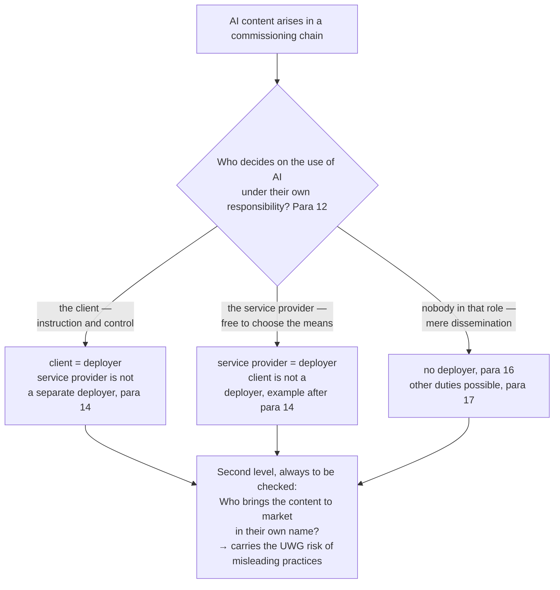

# Commissioning chains: who is the deployer, who labels, who is liable

> 🤖 **Made with AI — no editorial review.** This text was produced by AI agents
> and machine-verified against the official sources. It has **not undergone
> editorial review by a human with relevant subject-matter expertise**; the
> exception in Article 50(4), second subparagraph of the AI Act is therefore
> **not claimed**. What was verified and what was not:
> [Provenance](../../PROVENANCE.md).

> ⚠️ **Not legal advice.** This playbook is a technical and editorial working aid. The European
> Commission's guidelines (C(2026) 5054 final) are legally non-binding; only the Court of Justice of
> the European Union can interpret the AI Act with binding effect. There is no case law on
> Article 50 yet — this playbook builds a defensible position, not a safe harbour.
> **As of: 24 August 2026.**

"We build websites with partly AI-generated images — do we have to label, or does the client?" That
is the most common practical question on Article 50, and it has **two** answers, because two regimes
run alongside each other:

1. **AI Act:** the labelling duty falls on the **deployer** — and the deployer is whoever decides on
   the use of AI under their own responsibility. That is not automatically the one who publishes,
   and not the one who moves the mouse.
2. **Unfair-competition law:** the risk of misleading practices falls on whoever brings the content
   to market in their own name — **regardless** of who produced the file.

Both questions have to be answered separately. The allocation under no. 1 does not dispose of no. 2.

**Whether** there is a labelling duty at all is settled by the
[decision tree](01-decision-tree.md) — this chapter settles **who** it falls on and who ultimately
answers for it.

---

## 1. The authority test: who is the deployer?

Under **Article 3(4) AI Act**, a deployer is anyone who uses an AI system **under their own
responsibility** — outside a purely personal, non-professional activity. The guidelines give the
term a workable shape in **para 12**:

> *"Deployers are natural or legal persons, public authorities, agencies or other bodies using
> AI systems under their authority, unless the use is for a personal non-professional activity.
> The 'authority' over an AI system should be understood as assuming responsibility over the
> decision to deploy the system and over the manner of the actual use of the system (including
> its outputs). It does not necessarily require technical control over the operation of the AI
> system, so long as the deployer takes the decision for what purposes and how to use the AI
> system (including in decentralised workflows and group corporate structures)."*
> — guidelines para 12 (with footnote 5: Article 3(4) AI Act)

Three test questions follow from this — in this order:

1. **Who decided THAT AI would be used?** (not: who operated it)
2. **Who decides on the MANNER of use** — which system, for what purpose, and which output goes
   out? Technical control is expressly **not** required (para 12).
3. **Who answers for the output to the outside world?**

Whoever draws all three questions to themselves is the deployer. Whoever answers none of them is not.

**What that means for people on the team:** employees and freelancers bound by instructions, who
work on the instructions of and under the responsibility and control of the commissioning party, are
**not separate deployers** — the duty stays with the person or company under whose authority the
system is used:

> *"Where the deployer of an AI system is a legal person under whose authority the system is used
> (e.g. an advertising company), the individual employees that act under the instructions and
> under the control of that legal person (e.g. digital animators, web designers, content creators,
> journalists) should not be considered as separate deployers for that system. A legal person
> remains a deployer even if it involves third parties (e.g. contractors, freelancers) in the
> operation of the system on its behalf and under its responsibility and control."*
> — guidelines para 14

That is a rule of allocation, not of relief: the company is liable for its people's use of AI and
therefore has to steer it **internally** (instruction, process, competence — cf. Code of Practice
Section 2, Measure 2.2, which expressly requires training and awareness measures for external
contractors too).

**Who falls out of the role:** whoever merely disseminates or transmits — hosting services, online
platforms, broadcasters — is **not** a deployer, as long as they have no authority over the use of
AI (para 16). And whoever builds or substantially modifies a system themselves and then uses it is
**both**: provider and deployer (para 15), and additionally owes the machine-readable marking under
Article 50(2) (→ [chapter 07](07-provider-marking.md)).

---

## 2. Case groups

| # | Constellation | Who decides on the use of AI? | Deployer under the AI Act | Source |
|---|---|---|---|---|
| 1 | Client commissions an advertisement **without** deciding on AI ("make me an image") | Agency | **Agency** — it labels; the client is not a deployer | Example paragraph after para 14: *"a company that merely commissions an advertising agency to produce an advertisement, without taking decisions and exercising control over whether and how the advertising agency uses AI in the production process, is not a deployer"* |
| 2 | Agency or freelancer operates the system **on the instructions and under the control** of the client (client specifies tool, prompt, sign-off) | Client | **Client** — the service provider is not a separate deployer | Para 14 |
| 3 | Publisher/broadcaster receives a **finished advertisement with an unlabelled AI image** and runs it | the advertiser or its agency | **not** the publisher, as long as its role is limited to dissemination | Para 16 (disseminators are not deployers); para 17 (other rulebooks can require labelling of their own — example: a broadcaster labels a deepfake in its programming) |
| 4 | **Content producer delivers**, the client publishes | whoever took the AI decision — work through questions 1–3 from section 1 | the decision-maker; but the label has to hold up through to **first exposure** to the audience | Para 12 (value chains); Article 50(5) |
| 5 | Employees, interns, contracted freelancers in day-to-day operations | the company under whose supervision the work is done | **the company** — never the individual person | Para 14 |
| 6 | Company builds/fine-tunes its own generative system and uses it itself | the company | **provider *and* deployer** — Article 50(2) **and** Article 50(4) | Para 15 |

**On case 3 — the uncomfortable gap:** under the AI Act no labelling duty attaches to the mere
disseminator; the guidelines do, however, expressly *encourage* it to preserve existing markings
and labels (*"strongly encouraged to preserve the marking and labelling implemented
pursuant to Article 50 AI Act"*, para 16) — and para 17 makes clear that other legal or professional
rules can require labelling of their own. Whether and how far a purely disseminating medium can be
held to account under unfair-competition law alongside that is a question of the UWG and is not
decided here.
⚠️ Grey zone — document the classification with a brief rationale (see [gate/](../../gate/README.md)).

**On case 4 — a shared decision:** where the commissioning party and the service provider decide
*jointly* on the use of AI (the client wants "something with AI", the agency picks the tool and the
motif), the allocation is not clear-cut. Then the rule is: name one party, record the reasoning and
label. Two labels do less harm than none.
⚠️ Grey zone — document the classification with a brief rationale (see [gate/](../../gate/README.md)).

---

## 3. The practical punchline: the publisher carries the UWG risk

The most important insight of this chapter is not in the AI Act:

> 🚧 **Whoever brings the content to market in their own name — own domain, own shop, own
> advertising message — carries the risk of misleading practices under §§ 5, 5a UWG (German Act
> against Unfair Competition), even where under the AI Act somebody else would have had to label.**

Why that weighs more heavily in practice than the fine:

- **No authority is needed.** Claims for injunctive relief are available to competitors, to
  registered trade and consumer associations and to chambers (**§ 8(3) UWG**). The warning letter
  (Abmahnung) comes from the competitor, not from the Bundesnetzagentur (BNetzA, the German market
  surveillance authority) — and it comes faster.
- **Unfair-competition law sits alongside the AI Act, not inside it.** The deepfake criterion is
  expressly independent of the concept of misleading practices in the Unfair Commercial Practices
  Directive (guidelines footnote 32), and the transparency duty does not permit unlawful content:
  *"does not imply that AI-generated or manipulated deep fakes that are harmful and unlawful under
  the applicable Union or national law (e.g. misleading advertising or criminal law …) may be
  generated and disseminated"* (para 129). In short: a label is no free pass — and a missing label
  is not the only risk. ⚠️ Whether Article 50 is additionally a market conduct rule within the
  meaning of § 3a UWG has not been settled by the highest courts
  (→ [chapter 08](08-legal-basis.md), section 4).
- **Recourse comes afterwards and depends on the contract.** The AI Act knows no recourse. Whoever
  receives a warning letter first signs the cease-and-desist declaration themselves, first pays the
  costs themselves and only then recovers them — in a second, separate set of proceedings — from
  the party that caused it, in so far as the contract carries that and that party is reachable and
  solvent.

Hence the division of labour in this chapter: the AI Act says **who has to label**; the contract
says **who ends up paying** when nobody did.

---

## 4. What the guidelines themselves require of commissioning chains

The guidelines address chains expressly — and name the contract as the instrument of choice:

> *"Deployers involved in complex content production and distribution value chains should take
> proportionate measures to ensure that the labelling of the content they have implemented
> pursuant to Article 50(4) AI Act is displayed in a clear and distinguishable manner for the
> targeted and foreseeable audience at the point of first exposure in accordance with
> Article 50(5) AI Act (e.g., via contractual conditions with distributing partners, user
> experience (UX) settings and interfaces to be displayed)."* — guidelines para 12

In plain terms: it is not enough to **apply** a label. The deployer has to take proportionate
measures to ensure that it actually **arrives** with the audience — through the contract with the
distribution partner, through the choice of delivery formats, through the UX. Anyone who delivers a
file with a burned-in label whose ad crop cuts it off has not discharged the duty
(crop check → [chapter 04](04-labelling-form.md), section 4.1).

For the **text exception** a second contractual question comes on top: who holds editorial
responsibility, and who reviews the substance? The Code of Practice requires non-media companies to
have a policy containing *"the identification of the natural or legal person with editorial
responsibility (name, role and contact details)"* (Section 2, Commitment 4); the guidelines want
those details published in an easily findable place (para 138). In a chain of agencies it therefore
has to be settled **whose** name appears there — details: [chapter 03](03-editorial-exception.md).

---

## 5. Checklist of points to settle in contracts

> ⚖️ **No model clauses.** This list says **what** to talk about, not **how** to word it. Drafted
> clauses belong in the hands of your own legal advisers — the checklist is the agenda for that
> conversation. And: a contract can govern the relationship between the parties, but it cannot
> shift the public-law duty. The addressee of the labelling duty remains whoever is the deployer
> under the authority test (section 1).

### 5.1 Disclosure of AI use between the parties

- [ ] Duty of the service provider to disclose AI use **unprompted** — per deliverable (text,
      image, audio, video, translation, subtitles) and per modality, not a blanket "AI was used".
- [ ] Follow-up notification if the use changes during the project (new tool, later image editing,
      AI translation of the final version).
- [ ] Clarification that **tool-internal** AI functions are covered too (generative fill, object
      removal, voice synthesis) — the line runs between functions, not between programs
      (→ [myths FAQ](06-myths-faq.md), myth 6).
- [ ] Handling of grey zones: who decides in case of doubt, and is the reasoning supplied with it?

### 5.2 Allocating the labelling duty along the decision-making authority

- [ ] Record expressly who decides on the use of AI — that determines the deployer role
      (paras 12, 14) and hence the duty.
- [ ] Who applies the label, in what form, in what language (→ [chapter 04](04-labelling-form.md))?
- [ ] Acceptance criterion: a deliverable counts as delivered only once the required label is
      present **and** visible/audible in the target format.
- [ ] Clarification that the allocation in the contract does not replace the statutory addressing
      of the duty (see the box above).

### 5.3 Preserving the label along the exploitation chain

- [ ] Prohibition on removing or covering up labels and machine-readable markings — the Code of
      Practice obliges provider signatories to include such a prohibition in their terms of use
      (Code of Practice Measure 1.2 "Non-removal of markings" — the provider obligation);
      down the chain it has to be passed on contractually.
- [ ] Crops, thumbnails, ad formats, reposts and secondary use: who checks that the label survives
      the crop (→ [tools/label-crop-check](../../tools/label-crop-check/README.md))?
- [ ] Passing on to distribution partners: proportionate measures to keep the label visible through
      to first exposure (para 12; Article 50(5)).
- [ ] Translations, CMS import, newsletter rendering: who ensures that the label travels along?

### 5.4 Responsibility for review and sign-off (text only)

For images, audio and video there is **no** editorial exception — there only the deepfake test
counts ([myths FAQ](06-myths-faq.md), myth 8). This block therefore concerns text only.

- [ ] Who reviews the substance — with what subject-matter qualification on the topic? A
      superficial or purely formal check is not enough (paras 134, 135).
- [ ] Who holds editorial responsibility, and with what contact details is it made public
      (para 138; Code of Practice Section 2, Commitment 4)?
- [ ] **Secure the order rule:** after editorial sign-off no substantive AI change may follow —
      *"Any substantive AI intervention occurring after the human review or editorial control process
      has taken place will therefore cause the exception to become void"*
      (para 136). Who in the chain is still allowed to touch the content after sign-off, and by what
      means?
- [ ] Who publishes at the end — and is there still an automated step in between (SEO optimiser,
      AI shortening for social, automatic summary)?

### 5.5 Handover of the evidence

- [ ] The service provider delivers the **review record** with it: `<name>.review.json` beside the
      content file, with reviewer, subject-matter competence, editorial responsibility, scope of
      the review, classification and the `content_sha256` of the released version (field list and
      check script: [gate/](../../gate/README.md)).
- [ ] Retention: who keeps the evidence, and for how long — and who produces it in response to a
      request for information from market surveillance? Non-signatories of the Code of Practice
      have to expect more requests for information, expressly including on their labelling practice
      (para 148).
- [ ] Negotiate the honest limit as well: the gate enforces the **process** and makes it auditable;
      it does not enforce the substantive quality of the review. It is a permitted documentation
      form going beyond the legal minimum (Code of Practice Section 2, Commitment 4), not a
      safe harbour.

### 5.6 Indemnity and recourse

- [ ] Who bears the costs of the warning letter, contractual penalties, the cease-and-desist
      declaration, recall and rectification effort if a label is missing or was placed wrongly?
- [ ] Does the indemnity also cover **misleading practices** (UWG) and third-party rights
      (copyright, trade mark, personality rights, data protection) — or only labelling? The
      guidelines expressly regard third-party rights as unaffected (paras 124, 127–129).
- [ ] Duties to cooperate and to inform in the event of a warning letter (deadlines are short),
      responsibility for the defence, cover under existing insurance policies.
- [ ] ⚠️ The drafting, scope and enforceability of such clauses are legal advice — this line does
      not replace it.

---

## Recap in brief

1. The deployer is whoever **decides on the use of AI under their own responsibility** — technical
   control is not required (para 12).
2. Anyone working on the instructions and under the control of another — employees, interns,
   freelancers bound by instructions — is **not** a separate deployer; the deployer remains the
   person or company under whose authority the system is used (para 14). Where the service provider
   does decide on the use of AI itself, it is the deployer (example after para 14 — point 3).
3. Whoever merely commissions, without deciding on the use of AI, is **not** a deployer — then the
   agency labels (example after para 14).
4. Whoever merely disseminates is not a deployer (para 16) — but may have to label under other
   rules (para 17).
5. Independently of that: **the publisher carries the UWG risk of misleading practices**
   (§§ 5, 5a, 8(3) UWG). Recourse is possible, but comes afterwards and depends on the contract.
6. The label has to survive the chain — the guidelines expressly name contractual conditions with
   distributing partners as the means (para 12).
7. Contracts govern the relationship between the parties, not who the duty is addressed to.

Sources and official documents: [chapter 08](08-legal-basis.md) · common misconceptions:
[myths FAQ](06-myths-faq.md) · evidence mechanics: [gate/](../../gate/README.md).
